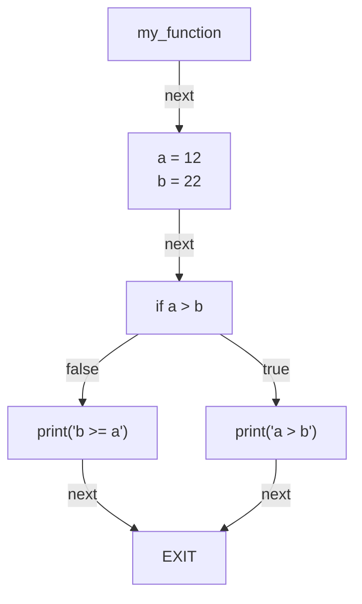
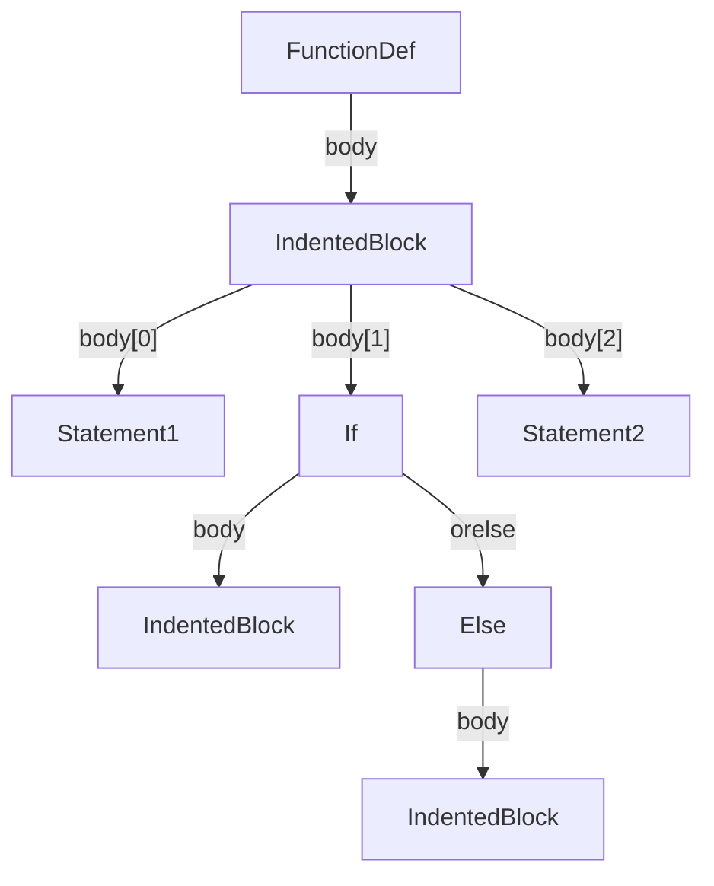
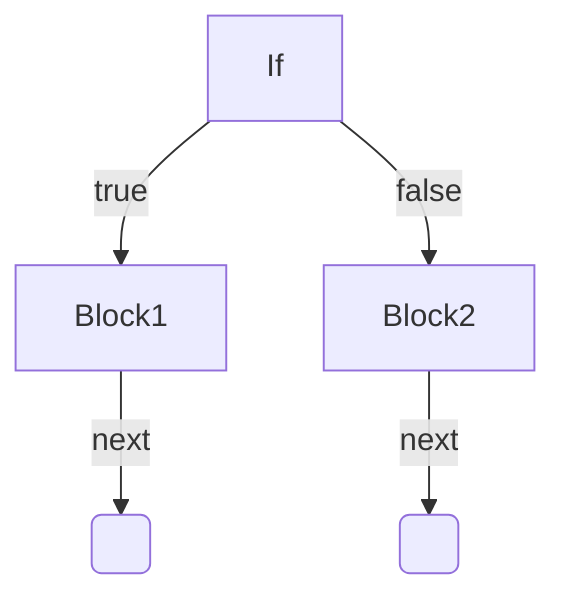
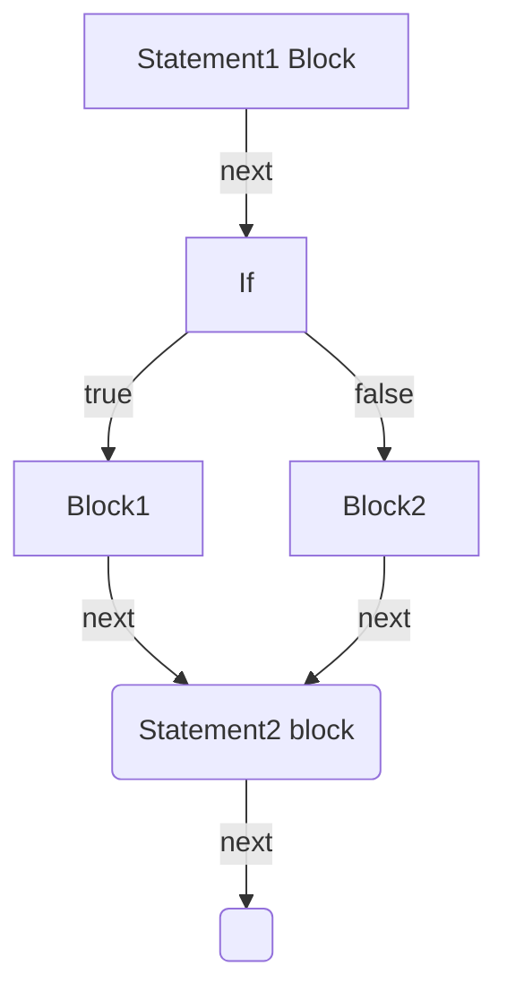
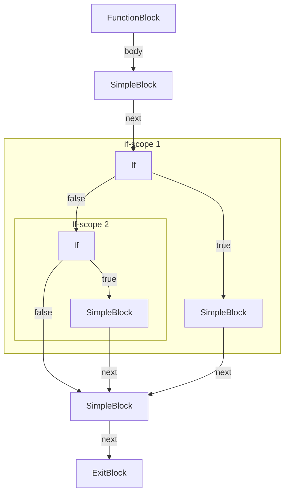

# Control Flow Graphs

_**Note:** This document assumes some familiarity with [LibCST](https://libcst.readthedocs.io/)._

A control flow graph (CFG) is a graph representation of all the paths that
might be traversed through a program during its execution. In a CFG, each node
represents a basic block, which is a straight-line sequence of code with a
single entry point and a single exit point. Directed edges between nodes
represent the possible control flow from one block to another. For example, the
graph below shows a CFG for a simple function.

Consider the following simple function:

```python
def my_function():
  a = 12
  b = 22
  if a > b:
    print("a > b")
  else:
    print("b >= a")
```

This function is represented as the following CFG:



Our CFG implementation only considers (and supports) single functions, i.e.,
module level code cannot be represented at this point.

## Definitions

Some definitions used throughout the CFG code.

- **block**: A node/vertex in the CFG. A single node represents 'branchless'
  logic, i.e., if a block is executed, all statements in the block are
  executed. Any form of branching is represented through edges. A block may
  have zero or more outgoing edges. For example, a `SimpleBlock` only has a
  `next` edge whereas an `IfBlock` has a `true` and `false` edge.
- **dominator**: Block $`A`$ is said to dominate block $`B`$ if block $`B`$
  cannot be reached from the entry block without passing through block $`A`$.
  Every block dominates itself.
- **strict dominator** Block $`A`$ is a strict dominator of block $`B`$ if it
  dominates $`B`$ but is not equal to $`B`$.
- **post-dominator**: Block $`A`$ is said to post-dominate block $`B`$ if the exit
  block cannot be reached from block $`B`$ without passing through block $`A`$.
- **immediate (post) dominator**: Block $`A`$ is an immediate dominator of
  block $`B`$ if $`A`$ strictly dominates $`B`$ and $`A`$ does not dominate any
  other block that also dominates $`B`$. The immediate post-dominator is
  defined analogously.

Domination is used to make inferences about data flow and on how to construct a
CST from a CFG. See [this lecture by Adrian
Sampson](https://www.cs.cornell.edu/courses/cs6120/2020fa/lesson/5/) for a more
in-depth discussion and examples.

## Blocks

The Following blocks are supported:

- **Block**: Abstract base class for all blocks.
- **FunctionBlock**: Represents a function and is always the entry block of a
  CFG. There can only be one `FunctionBlock` in every CFG and, by it being the
  entry block, it dominates all other blocks in the CFG.
- **SimpleBlock**: Represent code that never branches, i.e., the next block is deterministic.
- **BranchingBlock**: Abstract base class for all blocks that perform some form
  of logical branching, i.e., the next block is non-deterministic.
- **IfBlock**: Represents an if statement. It only 'captures' the test
  expression. The `true` and `false` branches are edges to other blocks.
- **ExitBlock**: Sink for the graph, all paths will end up in the `ExitBlock`.
  A graph can only have one `ExitBlock`. It follows that the `ExitBlock`
  post-dominates all other blocks in the graph.

The implements can be found in `autoquant.cfg.blocks`

## CFG Construction

The CFG construction follows a recursive method and is implemented in
`autoquant.cfg.construct`. Specifically, `autoquant.cfg.construct.construct` is
the entry point that takes a `libcst.FunctionDef` as input and returns a
`autoquant.cfg.blocks.FunctionBlock` which represents the root of the CFG.

As said, the construction method follows a recursive algorithm on the CST and
is implemented through `libcst.CSTNode` specific specializations of
`_block_from_FunctionDef` in `autoquant.cfg.construct`. Each of these
specializations is responsible for returning a (partial) CFG that represents
the entire sub-tree for which the input node is the root. This CFG may be a
partial CFG in the sense that is has dangling edges. These will be resolved by
connecting these edges (or tails) to the following control flow element. For
example, consider the following CST:



Now, consider the sub-tree that has the `If`-node as root. The partial CFG may
look something like this (this is the simplest case, it may contain more nodes
depending on the contents of the true and false branches):



Note that both the next edge for both the true and false branch is dangling.
From the CST we see that the control flow will always continue with
`Statement2` -- assuming there are no return statements. Hence, we can create a
CFG from sub-tree of the CST with the `Statement2`-node as root and 'connect'
both dangling edges from the If-statement CFG to the root of the newly created
CFG for the `Statement2` sub-tree. This is done using the `set_tail` method on
`blocks.Block`. Using this, we can call `set_tail` on the root block of the
`If` CFG, passing the new CFG. This will ensure that the dangling edges are
connected up forming a combined CFG. For example:

```python
statement1_cfg.set_tail(if_cfg)
statement1_cfg.set_tail(statement2_cfg)
```

Here we assumed we have three partial CFGs `statement1_cfg`, `statement2_cfg` and
`if_cfg`. We first combine `statement1_cfg` with `if_cfg` by setting all
dangling edges to the root of `if_cfg`. Then we set all the dangling edges of
the combined CFG (which are the dangling edges of the original `if_cfg`) to the
root of `statement2_cfg`. Assuming `statement1_cfg` and `staetment2_cfg` only consists
of a single `SimpleBlock`, the resulting CFG will look like this:



### Wrappers

  From this description, it may be clear that an `Else`-construct is simply
  represented as any block that is connected to an `IfBlock` through the
  `false` edge. This means that there is no explicit representation of an
  `Else` branch even though there is a CST node that may carry relevant
  metadata for CST reconstruction. For this, we use a 'wrapper' mechanism. Each
  block that is created can have one or more wrapper CST nodes associated with
  it. These can subsequently be used during reconstruction. The wrappers represent
  information that may be used on a CFG block or CST node level to convert the CFG
  back into a CFG. Hence, during CFG construction, there is no strict
  requirement on the type of wrappers that are used, but it must match the
  expectations of the reconstructions functions. This is acceptable because the
  construction/reconstruction functions will always have to work in pairs in
  order to guarantee a lossless CST-CFG-CST round-trip. For example, the
  reconstruction for a `SimpleBlock` assumes that every `SimpleBlock`'s first
  wrapper is an `IndentedNode`. Please refer to the code and corresponding
  docstring in `reconstruction.py` for more information.

  Wrappers are added to blocks during the CFG construction process using
  `Block.push_wrapper`

## CST Reconstruction

For this section we will use the following code as a running example. Here
`<block X>` may refer to any block of code without any form of branching (i.e.,
a block of code represented as a `SimpleBlock`). `<test X>` refers to an
expression that is evaluated for truthiness.

```python
def func():
  <block 1>
  if <test 1>:
    <block 2>
  elif <test 2>:
    <block 3>
  <block 4>
```

This code results in the following CFG:



The goal of CST reconstruction is to obtain a valid CST from a CFG. This way,
we can rely on LibCST's code generation to produce (valid) python code. CST
reconstruction. CST Reconstruction follows a recursive method. In
`reconstruct.py` various specializations of `reconstruct_block` are
implemented. Each of these specializations takes a specific `Block`-type and
returns an `libcst.IndentedBlock`. These may then get merged into bigger
`IndentedBlock`s or become parts of other constructs.

Since a CFG is not a tree, we cannot simply recursively reconstruct the entire
subtree for which a node is the root. Instead, the `reconstruct_block`
specializations are expected to reconstruct a partial CST for all blocks that
are dominated by the input block.
